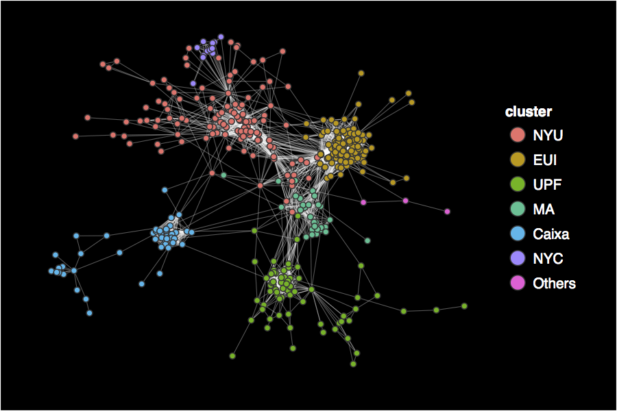
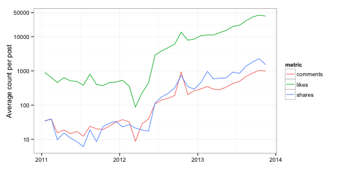

Rfacebook: Access to Facebook API via R
---------

This package provides a series of functions that allow R users to access Facebook's API to get information about public pages, groups, and posts, as well as some of the authenticated user's private data.

Current CRAN release is 0.6.3. To install the most updated version (0.6.5) from GitHub using devtools, type:

```r
library(devtools)
install_github("pablobarbera/Rfacebook/Rfacebook")
```

Click <a href="https://cran.r-project.org/web/packages/Rfacebook/Rfacebook.pdf">here</a> to read the documentation.

<h3>Installation and authentication</h3>

<p>Rfacebook can be installed directly from CRAN, but the most updated version <a href="https://github.com/pablobarbera/Rfacebook">will always be on GitHub</a>. The code below shows how to install from both sources.</p>

```r
install.packages("Rfacebook") # from CRAN
library(devtools)
install_github("pablobarbera/Rfacebook/Rfacebook") # from GitHub

```

<p>Most API requests require the use of an access token. There are two ways of making authenticated requests with Rfacebook. One option is to generate a temporary token on the <a href="https://developers.facebook.com/tools/explorer/">Graph API Explorer</a>. Then just copy and paste the code into the R console and save it as a string vector to be passed as an argument to any Rfacebook function, as I show below. However, note that this access token will only be valid for two hours. It is possible to generate a &#39;long-lived&#39; token (valid for two months) using the `fbOAuth` function, but the process is a bit more complicated. For a step-by-step tutorial, check this <a href="http://thinktostart.wordpress.com/2013/11/19/analyzing-facebook-with-r/">fantastic blog post</a> by <a href="https://twitter.com/JulianHi">JulianHi</a>.</p>

```r
# token generated here: https://developers.facebook.com/tools/explorer 
token <- 'XXXXXXXX'
me <- getUsers("me", token, private_info=TRUE)
me$name # my name
# [1] "Pablo Barberá"
me$hometown # my hometown
# [1] "Cáceres, Spain"

```

<p>The example above shows how to retrieve information about a Facebook user. Note that this can be applied to obtain information about any user (or vector of users) with public profiles -- that is, pages. Both user screen names or IDs can be used as arguments, e.g.:</p>

```r
getUsers(c("barackobama", "donaldtrump"), token)

```

<p>This function cannot be used to obtain profile information for users with private profiles, with the exception of those profiles who are using the application created by the authenticated user. When using a temporary token, only the information of profiles who have ever created a temporary token in the authenticated user's network of friends will be returned.</p>

<h3>Analyzing your network of friends</h3>

<p>The function `getFriends` allows the user to capture information about their Facebook friends, as long as they are using the application created to authenticate with the API. Since user IDs are assigned in consecutive order, it's possible to find out which of our friends was the first one to open a Facebook account. 

```r
my_friends <- getFriends(token, simplify = TRUE)
head(my_friends$id, n = 1) # get lowest user ID

```

<p>To access additional information about a list of friends using the token application, you can use the `getUsers` function, which will return a data frame with users' Facebook data. Some of the variables that are available for all users are: gender, language, and country. It is also possible to obtain relationship status, hometown, birthday, and location for our friends if we set `private_info=TRUE`. (Note that language and country are extracted from the `locale` <a href="https://developers.facebook.com/docs/internationalization/">codes</a>.)</p>

```r
my_friends_info <- getUsers(my_friends$id, token, private_info = TRUE)
table(my_friends_info$gender)  # gender
table(substr(my_friends_info$locale, 1, 2))  # language
table(substr(my_friends_info$locale, 4, 5))  # country
table(my_friends_info$relationship_status)  # relationship status
```

<p>Finally, the function `getNetwork` extracts a list of all the mutual friendships among the friends using the application with which the token was created. This list can be then used to analyze and visualize a Facebook ego network. The first step is to use the `getNetwork` function. If the `format` option is set equal to `edgelist`, it will return a list of all the edges of that network. If `format=adj.matrix`, then it will return an adjacency matrix of dimensions (n x n), with n being the number of friends, and 0 or 1 indicating whether the user in row 'i' is also friends with user in column 'j'.</p>

```r
mat <- getNetwork(token, format = "adj.matrix")
dim(mat) # dimension of matrix
```

<p>This adjacency matrix can then be converted into an igraph object, which facilitates the task of computing measures of centrality, discovering communities, or visualizing the structure of the network. As an illustration, the plot below displays my Facebook ego network, where the colors represent clusters discovered with a community detection algorithm, which clearly overlap with membership in offline communities. This was one of the examples from my <a href='https://github.com/pablobarbera/Rdataviz'>workshop on data visualization with R and ggplot2</a>. The code to replicate it with your own Facebook data is available <a href='https://github.com/pablobarbera/Rdataviz/blob/master/code/05_networks.R'>here</a>. David Smith has also <a href="http://blog.revolutionanalytics.com/2013/11/how-to-analyze-you-facebook-friends-network-with-r.html">posted code to generate a similar network plot</a>.</p>

<center></center>

<p>Note that since version 2.0 of the Graph API, only the friends using the application with which the authenticated token was created are returned by this application. Old versions of the API are no longer available.</p>


<h3>Searching public Facebook posts</h3>

<p>Prior to version 2.0 of the Graph API, it was possible to collect public Facebook posts mentioning specific keywords, using the `searchFacebook` function. This option is no longer available through the public API.

<h3>Analyzing data from a Facebook page</h3>

<p>Facebook pages are probably the best source of information about how individuals use this social networking site, since all posts, likes, and comments can be collected combining the `getPage` and `getPost` functions. For example, assume that we're interested in learning about how the Facebook page <a href="https://www.facebook.com/humansofnewyork">Humans of New York</a> has become popular, and what type of audience it has. The first step would be to retrieve a data frame with information about all of its posts using the code below. To make sure I collect every single post, I set `n` to a very high number, and the function will stop automatically when it reaches the total number of available posts (3,674).</p>

```r
page <- getPage("humansofnewyork", token, n = 5000)
page[which.max(page$likes_count), ]
##              from_id          from_name
## 1915 102099916530784 Humans of New York
               message
## 1915 Today I met an NYU student named Stella.  I took a photo of her.  (...)
##                  created_time  type
## 1915 2012-10-19T00:27:36+0000 photo
##                                                                                                                            link
## 1915 https://www.facebook.com/photo.php?fbid=375691212504985&set=a.102107073196735.4429.102099916530784&type=1&relevant_count=1
##                                   id likes_count comments_count
## 1915 102099916530784_375691225838317      894583         117337
##      shares_count
## 1915        60528
```

<p>The <a href="https://www.facebook.com/photo.php?fbid=375691212504985&set=a.102107073196735.4429.102099916530784&type=1&relevant_count=1">most popular post ever</a> received almost 900,000 likes and 120,000 comments, and was shared over 60,000 times. As we can see, the variables returned for each post are the same as when we search for Facebook posts: information about the content of the post, its author, and its popularity and reach. Using this data frame, it is relatively straightforward to visualize how the popularity of Humans of New York has grown exponentially over time. The code below illustrates how to aggregate the metrics by month in order to compute the median count of likes/comments/shares per post: for example, in November 2013 the average post received around 40,000 likes.</p>

```r
## convert Facebook date format to R date format
format.facebook.date <- function(datestring) {
    date <- as.POSIXct(datestring, format = "%Y-%m-%dT%H:%M:%S+0000", tz = "GMT")
}
## aggregate metric counts over month
aggregate.metric <- function(metric) {
    m <- aggregate(page[[paste0(metric, "_count")]], list(month = page$month), 
        mean)
    m$month <- as.Date(paste0(m$month, "-15"))
    m$metric <- metric
    return(m)
}
# create data frame with average metric counts per month
page$datetime <- format.facebook.date(page$created_time)
page$month <- format(page$datetime, "%Y-%m")
df.list <- lapply(c("likes", "comments", "shares"), aggregate.metric)
df <- do.call(rbind, df.list)
# visualize evolution in metric
library(ggplot2)
library(scales)
ggplot(df, aes(x = month, y = x, group = metric)) + geom_line(aes(color = metric)) + 
    scale_x_date(breaks = "years", labels = date_format("%Y")) + scale_y_log10("Average count per post", 
    breaks = c(10, 100, 1000, 10000, 50000)) + theme_bw() + theme(axis.title.x = element_blank())
```

<center></center>

It is also possible to subset posts by date. For example, imagine we want to get only posts posted during 2015:

```r
page <- getPage("humansofnewyork", token, n = 5000, since='2015/01/01', until='2015/12/31')
```

<p>To retrieve more information about each individual post, you can use the `getPost` function, which will return the same variables as above, as well as a list of comments and likes. Continuing with my example, the code below shows how to collect a list of 1,000 users who liked the most recent post, for which we will also gather information in order to analyze the audience of this page in terms of gender, language, and country.</p>

```r
post_id <- head(page$id, n = 1)  ## ID of most recent post
post <- getPost(post_id, token, n = 1000, likes = TRUE, comments = FALSE)
```

<h3>Analyzing data from a Facebook group</h3>

Just like public Facebook pages, the data from public groups can also be easily downloaded with the `getGroup` function. Note that this will only work for groups that the authenticated user is a member of.

```r
group <- getGroup("150048245063649", token, n=50)
```


<h3>Extracting personal information</h3>

Rfacebook also allows to read personal information about the authenticated user, such as the list of likes and the content from the Newsfeed. Private information about the user's friends is no longer available through the API.

```r
getLikes('me', token)[1,]
## id           names
## 1 687958677914631 FiveThirtyEight
## website
## 1 http://www.fivethirtyeight.com/ 
```
```r
getNewsfeed(token, n=1)
## 1 51191684997 Rob DenBleyker  <NA>    <NA>
##                                                                    message
## 1 Sorry for the late comic, it's up now!\n\nhttp://explosm.net/comics/3512/
##               created_time type                            link
## 1 2014-04-02T12:38:46+0000 link http://explosm.net/comics/3512/
##                              id likes_count comments_count   shares_count
## 1 51191684997_10152084439949998        6942            110            497
```

<h3>Executing other API calls</h3>

To facilitate making API queries not implemented in the current version of the package, I have added the `callAPI` function, which will return an R list with the result of the query. A trivial example:

```r
callAPI("https://graph.facebook.com/v2.0/barackobama?fields=id", token)
```

<h3>Page insights</h3>

Rfacebook provides some limited access to the insights features, available admin accounts of public pages. See the documentation of `getInsights` for more information. 


<h3>Updating your Facebook status from R</h3>

<p>Finally, yes:</p>

```r
updateStatus("You can also update your Facebook status from R", token)
## Success! Link to status update:
## http://www.facebook.com/557698085_10152090718708086
```

<p>However, to make this work you will need to get a <a href="http://thinktostart.wordpress.com/2013/11/19/analyzing-facebook-with-r/">long-lived OAuth token</a> first, setting `private_info=TRUE` in the `fbOAUth` function.</p>

<h3>Frequently Asked Questions</h3>

- How can I search public Facebook posts? Can I get any information from users' private profiles? How can I extract my entire network of friends?

All these features used to be available through the API, but unfortunately that's not the case anymore. There's no fix to Rfacebook that could bring back these features.

- I get the following error when I run `getUsers`: `username is deprecated for versions v2.0 and higher`

This is related to the previous question. It is no longer possible to query users by their user names. If the user is a public page, try with the page ID number.

- For any other questions, feature requests, or bugs, please open an issue in this repository.


<script type="text/javascript">

  var _gaq = _gaq || [];
  _gaq.push(['_setAccount', 'UA-1191254-10']);
  _gaq.push(['_trackPageview']);

  (function() {
    var ga = document.createElement('script'); ga.type = 'text/javascript'; ga.async = true;
    ga.src = ('https:' == document.location.protocol ? 'https://ssl' : 'http://www') + '.google-analytics.com/ga.js';
    var s = document.getElementsByTagName('script')[0]; s.parentNode.insertBefore(ga, s);
  })();

</script>

